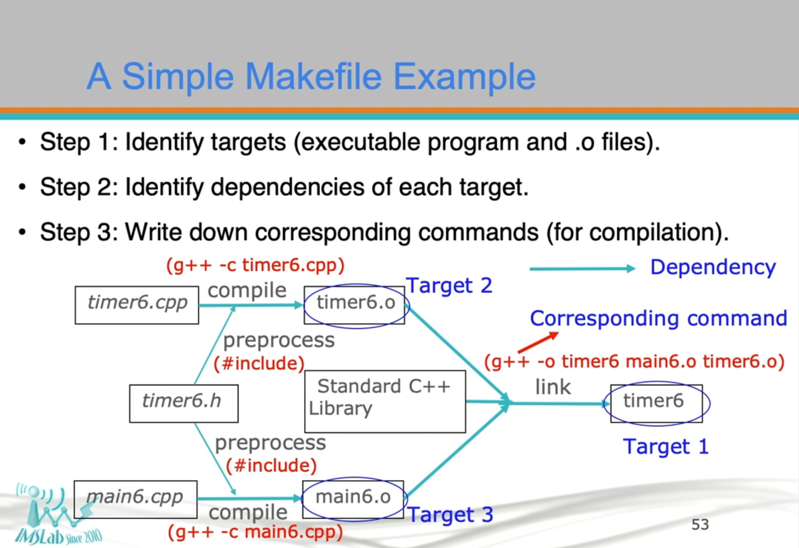
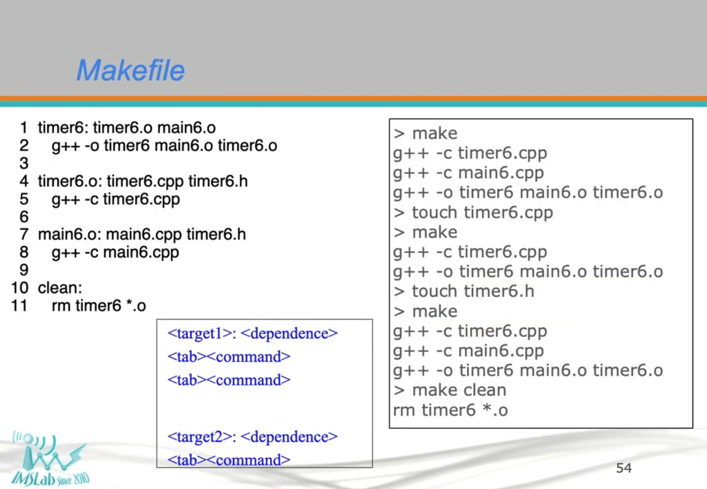

# Programming Design II

NCKU 108 Spring - Programming Design II by Prof. Meng-Hsun Tsai

## YouTube:
https://youtube.com/playlist?list=PLwlx1AGudCMcZsnfJOmJktdngEAdXKckg&si=YgYaIjR8TCgXiSJ_

## Makefile Concept
check [lec2](./lec2) for more details

